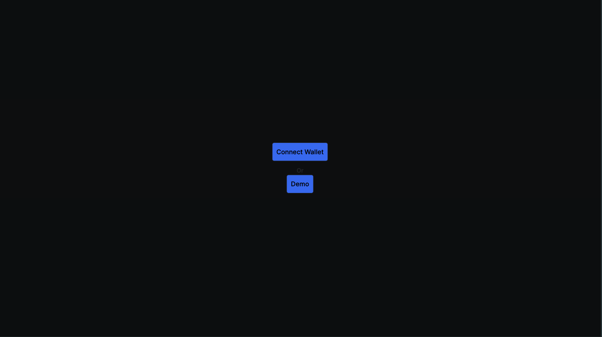
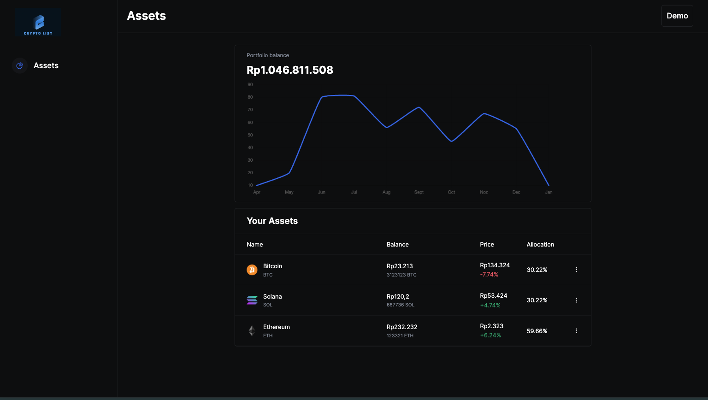
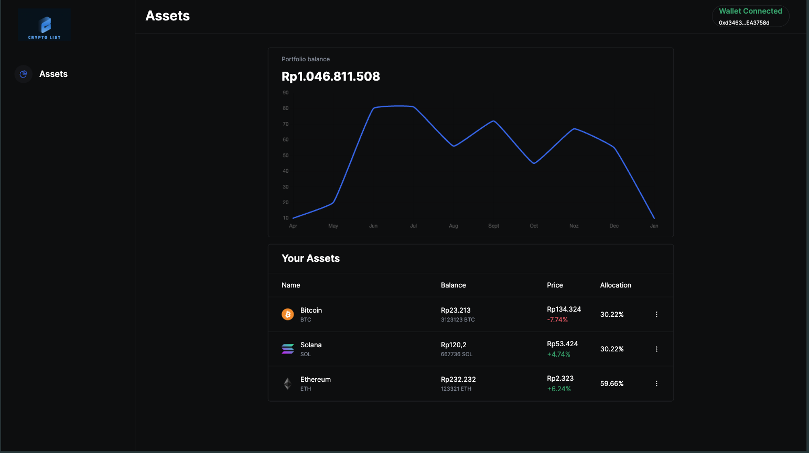

This is a [Next.js](https://nextjs.org/) project bootstrapped with [`create-next-app`](https://github.com/vercel/next.js/tree/canary/packages/create-next-app).

## Getting Started

First, run the development server:

```bash
npm run dev
# or
yarn dev
# or
pnpm dev
# or
bun dev
```

Open [http://localhost:3000](http://localhost:3000) with your browser to see the result.

## Stacks

* React Next.js
* Netlify
* Sanity
* Thirdweb
* Metamask
* Styled Components
* React Use Web Socket
* Websocket using coincap


### Features
#### this app web app have two menus, demo and connect, this app show list data from api, and also the table data is dummy, only column price with dynamic using websocket to get realtime data, the api data build with sanity. and the chart also is using dummy data.

#### menus

#### demo

#### connect account

##### you can connect to your metamask to see the address

